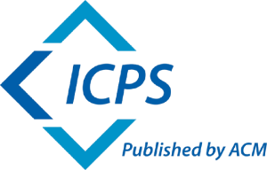

# Camera Ready Instructions

Authors will receive emails from the proceedings chair to finalize the metadata information for their papers. Then, the authors will receive emails from ACM e-Rights System and ACM Publishing System (TAPS) with complete instructions for submitting the rights form and camera-ready copy of their paper. Each paper must have a registration at the conference. Please note that these instructions will not come from us, the event organizers, nor the EasyChair conference management system. An overview of the process follows.

## Copyright form and camera-ready submission

Copyright form submission and camera-ready uploading for SSDBM is handled by the ACM e-Rights System and the ACM Publishing System (TAPS), respectively. In particular, the process is the following:

1. Submitting the copyright form (ACM e-Rights System): One of the corresponding authors of each paper will receive an email with instructions from ACM Rights Review (rightsreview@acm.org). The author must follow the URL included in the email to submit the copyright form on behalf of the other authors. During this step the author should carefully review (and, if needed, revise) paper metadata (e.g., paper title, author details) before submitting the form.

2. Submitting the camera-ready version of the manuscript (TAPS): Approximately 12 hours after authors successfully complete their e-Rights form, the first author will receive an email instructing them to upload their source files directly to The ACM Production System (TAPS). TAPS will generate output in PDF and HTML formats, which the authors will need to review and approve. The same email informs the author on:

   * how to include rights and permissions information and the bibliographic strip into the camera-ready version; and
   * how to submit the camera-ready PDF and the source files to TAPS following the provided instructions.

**Important**: Pay attention to the fact that these two emails are sent by different systems and may be addressed to different authors. Please make sure the emails have not wound up in a Spam folder. 

## Camera-ready preparation guidelines

When preparing the camera-ready version, please consider the following points:

1. After completing their e-Rights form, authors will be emailed the complete rights text and bibliographic strip that must be added to their paper.

2. Ensure that your camera-ready version complies with the [ACM Master Template](https://www.acm.org/publications/proceedings-template). You should use the "sigconf" proceedings template. If you have any problems with the templates, please contact ACM’s TeX support team at Aptara (<acmtexsupport@aptaracorp.com>).

3. Use the online [CCS indexing tool](https://dl.acm.org/ccs) to select appropriate CCS concepts for your article. Then, generate the corresponding text/code and include it into your camera-ready version.

4. Include appropriate user-defined keywords and the ACM Reference Format text.

5. Paying attention to the following guidelines for the PDF file:

   * Adhere to the page limits: 12 pages for full papers, 6 pages for short papers (including references).
   * Page size should be US-Letter 8.5in x 11in (around 21.59cm x 27.94cm).
   * All fonts must be Type 1 (scalable) or TrueType, and not Type 3 (bit-mapped). All fonts must be embedded within the PDF file.

## Important note to authors about the new ACM Open Access publishing model

ACM has introduced a new open access publishing model for the International Conference Proceedings Series (ICPS). Authors based at institutions that are not yet part of the ACM Open program will be required to pay an article processing charge (APC) to publish their ICPS article in the ACM Digital Library, unless one of their co-authors' institutions is a member or they qualify for a waiver. To determine whether or not an APC will be applicable to your article, please follow the detailed guidance here: https://www.acm.org/publications/icps/author-guidance.

For 2025 ACM is providing a subsidy on APC pricing for ICPS, as follows:

   * The 2025 subsidized APC rate for ICPS papers will be $350.
   * For papers where any of the authors is a member of ACM, the APC rate will be $250.
   * For ICPS papers whose corresponding author is based in a lower-middle-income country, the APC rate will be $175.
   * For ICPS papers whose corresponding author is based in a lower-middle-income country and where any of the authors is a member of ACM, the APC rate will be $125.
   * For ICPS papers whose corresponding author is based in a low-income country, no APC is required.
   * The subsidized pricing will apply to all papers that are processed through the ACM eRights system from 12:00 noon (US Eastern time) on March 6, 2025. Please note that ACM will not be providing refunds for APCs that have already been paid at that time.

Further information may be found on the ACM website:

- [Full details of the new ICPS publishing model.](https://www.acm.org/publications/icps/faq)
- [Full details of the ACM Open program.](https://www.acm.org/publications/openaccess)

Please direct all questions about the new model to icps-info@acm.org.

